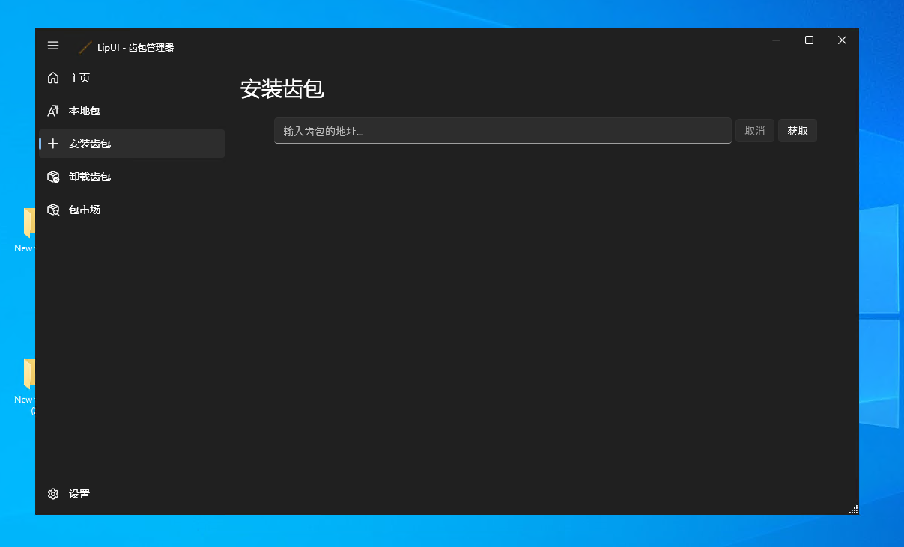

# lipUI Quickstart

To simplify the usage in the maximum extent, lipUI is provided. It is a GUI application that can be used to install, uninstall, and manage lip teeth. It is also a good way to get started with lip.

## Prerequisites

Before you start, you need to install lip. You can find the installation guide [here](installation.md).

lipUI only runs on Windows. If you are using Linux or macOS, you can use the command-line interface of lip.

lipUI depends on .NET 7.0 or .NET Framework 4.6.2. For most distributions of Windows 10, Windows 11, Windows Server 2019 and Windows Server 2022, .NET Framework 4.6 is bundled. Therefore, you are likely to be able to run lipUI directly. If you don't have .NET Framework installed, you can download .NET 7.0 [here](https://dotnet.microsoft.com/download/dotnet/7.0).

## Installation

lipUI is a portable application. You can download the latest version of lipUI [here](https://github.com/lippkg/lipUI/releases/latest). You can put it anywhere you want.

## Usage

Just run `lipUI.exe` and you will see the main window of lipUI. First, you need to select a workspace. A workspace is a directory that contains all the teeth you installed. For Bedrock Server users, the workspace is the directory that contains `bedrock_server.exe`. You can add multiple workspaces. lipUI will automatically detect the teeth in the workspace.

After you select a workspace, you can install, uninstall, and manage teeth. You can also use the search box to search for teeth.

For teeth not in the registry, you can install them by clicking the `Install` button. You can also install teeth from a URL or a tooth file.

