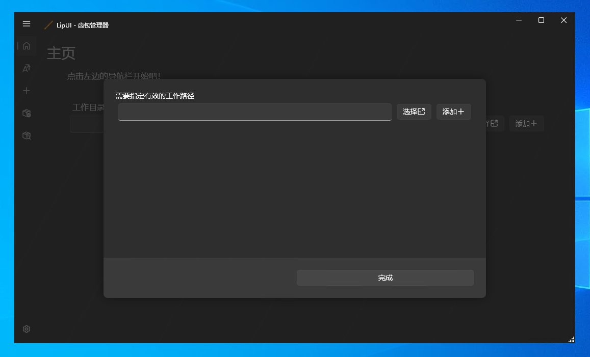
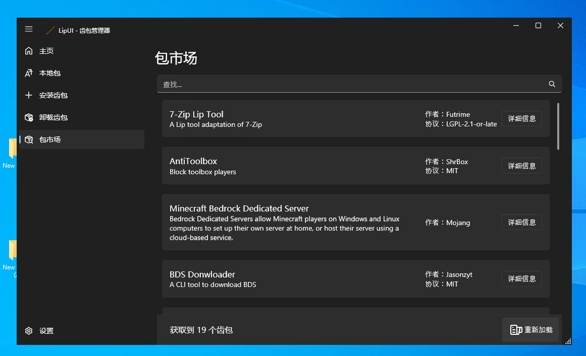

# LipUI快速入门

为了在最大程度上简化使用，我们提供了LipUI。它是一个GUI应用程序，可以用来安装、卸载和管理Lip tooth。它也是开始使用Lip的一个好方法。

## 在开始之前

在你开始之前，你需要安装Lip。你可以找到安装指南[安装](installation.md)。

- 另外需求注意：请尽可能使用较新版本的Lip 以确保LipUI的正常运行

LipUI只在Windows上运行。如果你使用的是Linux或macOS，你可以使用Lip的命令行界面。

LipUI依赖于.NET 7.0或.NET Framework 4.6.2。对于Windows 10、Windows 11、Windows Server 2019和Windows Server 2022的大多数发行版，.NET Framework 4.6是捆绑的。因此，你很可能能够直接运行LipUI。如果你没有安装.NET框架，你可以下载[.NET 7.0](https://dotnet.microsoft.com/download/dotnet/7.0)。

## 安装

LipUI是一个便携式的应用程序。你可以下载LipUI的最新版本[这里](https://github.com/LipPkg/LipUI/releases/latest)。你可以把它放在你想要的任何地方。

## 使用

只要运行`LipUI.exe`，你就会看到LipUI的主窗口。首先，你需要选择一个工作区。工作区是一个包含你所安装的所有牙齿的目录。对于Bedrock Server用户，工作区是包含`bedrock_server.exe`的目录。你可以添加多个工作区。LipUI将自动检测工作区中的tooth。

在你选择一个工作区后，你可以安装、卸载和管理tooth。你还可以使用搜索框来搜索tooth。

对于不在注册表中的tooth，你可以通过进入 `安装齿包` 页面 输入 URL 或者本地文件路径来安装他们。

